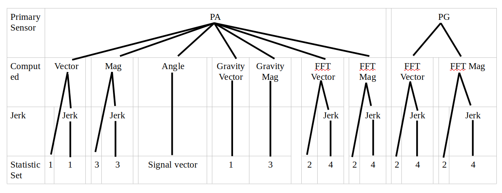
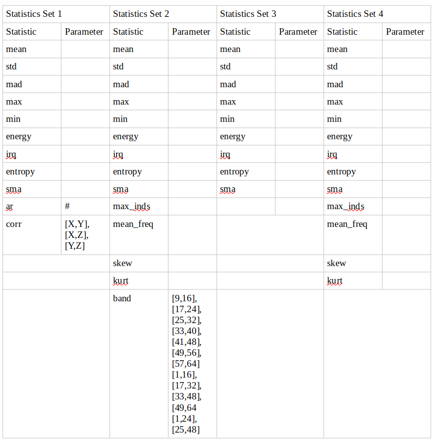
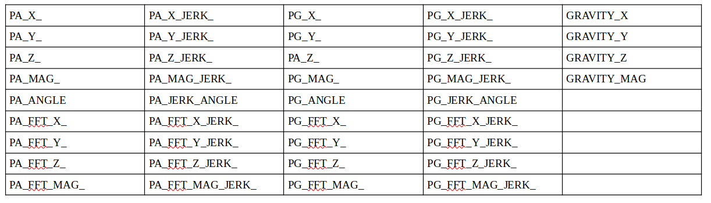
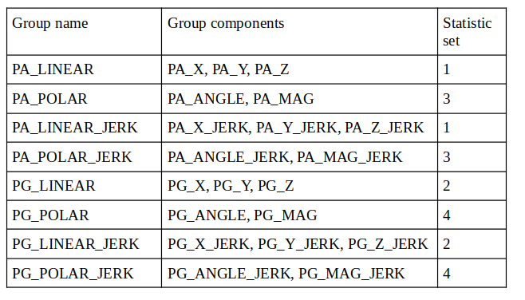
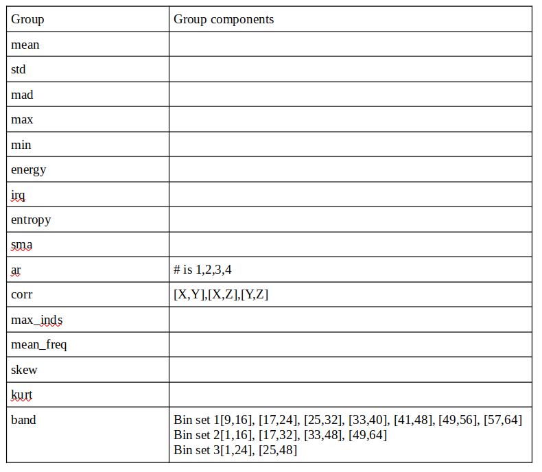

```{r setup, include=FALSE}
knitr::opts_chunk$set(echo = TRUE)
```

# Introduction

The UCI HAR Dataset consists of several data files, metadata files, and some informational files. The data was collected from the accelerometer and gyroscope signals produced by several Samsung Galaxy S Smartphones. Each phone was carried by a test subject and the signals were monitored for movement. When a subject moved, the phone produced a signal representing the phone’s—and by extention the subject’s—linear acceleration and angular velocity.

The goal of UCI study is to predict various activities of each subject. These include walking, walking upstairs, walking downstairs, sitting, standing, and laying. To support the study, the data were stored in space-delimited text files of the raw signal data and were use to derived data as part of their study including the analysis of “jerking” movements, the gravitational direction based on the phone’s axial orientation, calculation of the magnitudes of raw and derived vectors, and fast-fourier transforms (FFT) of collections of these data. In addition to these computations, the researchers also synthesized various statisical measures for input variables. These include the mean and standard deviation. The complete dataset, including the prediction variable (“activity”) and a subject id for every input observation. The dataset was then divided into a training set and a testing set.

The training and testing sets were provided for the “run_analysis” project with the following goals:
* Reconstruct the complete dataset.
* Collect the mean and standard deviations from the recontructed dataset and store them as a separate dataset.
* Rename the column/variable names to a human readable format
* Convert integer encodings to factors
* Clean the dataset consisting of mean and std derived variables.

# Renaming process

The original data names appear to have been produced by on:
1. Whether the data was from the original time-series or was transformed using a FFT. To indicate which variable is which, the researchers attached a ‘t’ or ‘f.’ They refer to ‘t’ as the time-domain and ‘f’ as the frequency domain.
2. The second component of a variable name is identifying the source of signal, the subject (Body) moving or gravity (Gravity).
3. The third component identifies the source of the measurement, the accelerometer (Acc) or the gyroscope (Gyro) 
4. The fourth component is more complex the other components:
  + None—the raw signals
  + “Jerk” due to the subject’s movement (Jerk)
  + “Mag” or the magnitude of a specific vector, e.g. the acceleration vector of the phone
  + “JerkMag” the magnitude of a jerk vector.
  + The fifth component is a statistical measure, parameters if necessary and an indication of the axis if necessary.

Unfortunatly, this naming process appears to be informal and was left open for some abuses. For example, the frequency-domain signal for the body’s acceleration due to a jerking movement was converted to fBodyBodyAccJerk. The names are themselves redundant and misleading. Neither the gyroscope nor the accelerometer signals are from the body, they are directly from the phone, so it is only an approximation to the body’s movement. The accelerometer variable, tBodyAcc-mean()-X, means “the mean of the body’s acceleration as measured by the phone’s acceleration in the x-direction and in the time-domain.” What it really means is, “the mean of the phone’s accelerometer signal in the x-direction.” Since the phone’s accelerometer implies an approximation to the body’s acceleration, we do not need of this verbiage. Likewise, the source signal is collected in the time-domain. By virtue of being in the time-domain adding it to the name is further redundency.

Renaming these requires a reconsideration of what is measured and why. The structure of a new name is as follows:

1. Primary data source: the accelerometer and the gyroscope – PA, PG. These are reported as vectors in the x-, y-, and z-axes. The primary data sources indicate they signals are in the time-domain and represent one or two 
2. Computed data source: gravity, FFT, and angle - _Gravity, _FFT, and _Angle. Gravity and the FFT sources are as vectors in the x-, y-, and z-axes, the Angle is reported in radians. NOTE, not all variables are computed from a data source so this component will not always appear.
3. Acceleration dependent derived data or the “jerk” vector: “_Jerk”. NOTE, not all variables are computed from a data source so this component will not always appear.
4. Vector magnitude: “_Mag.” This is a scalar and is not used with all variables.
5. Statistical measure: all variables, with the exception of angles, include a statistical computation. The time-series vectors use statistics set 1, the frequency-domain uses statistics set 2, the time series vector magnitudes use statistics set 3, and the frequency-domain vector magnitudes use statistics set 4. The definitions of the statistics series are discussed later in this section.
6. Computed angle: the angle is represented by two vectors. The first is found among the source or derived data.  The second is the gravitational vector derived earlier.

These principles lead to the following decomposition

image: 

Each of the leaves in the tree above references one of the following statistic sets

image: 


# New naming structures
Based on the renaming principles and the statistical sets, the new names will be constructed as follows 

image: 

Variables with _ X _, _ Y _, and _ Z _ variations will be grouped as linear vectors. PA and PG acceleration and jerk variables also include magnitude and angle so they constitute a vector in polar coordinates. These variables will be grouped as follows:

image: 

The names of the statistical suffix are as follows

image: 


